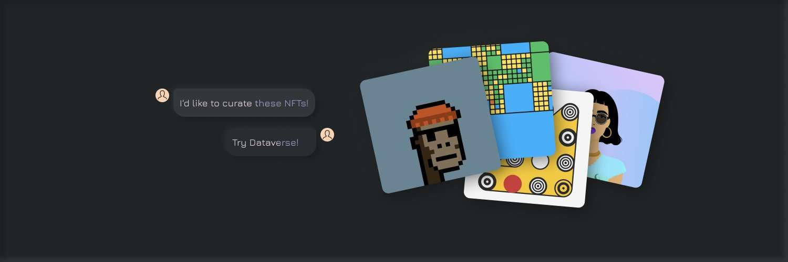
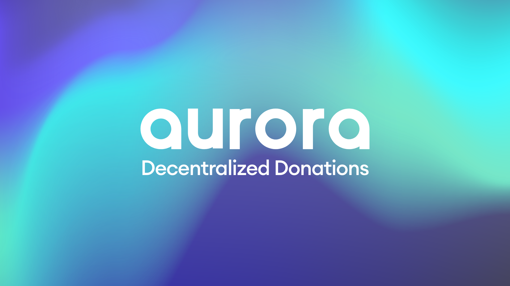
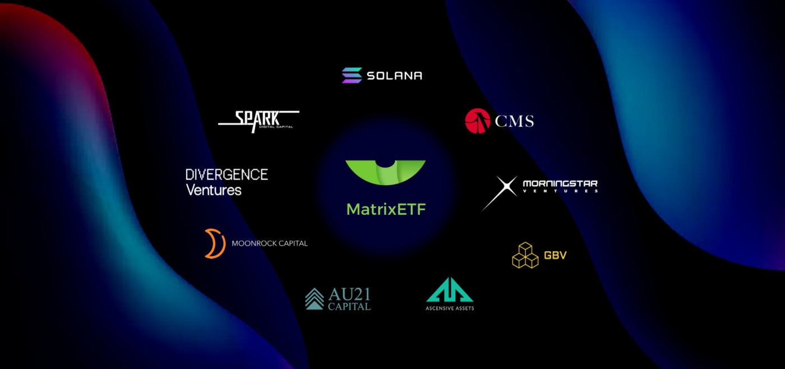
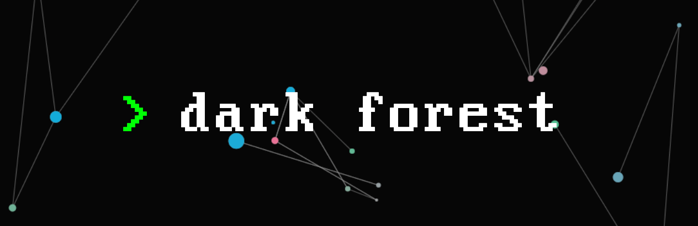
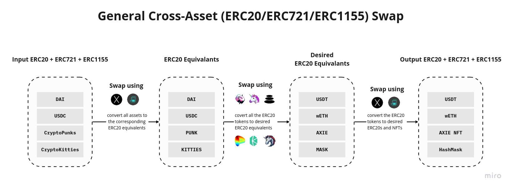
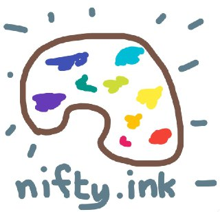
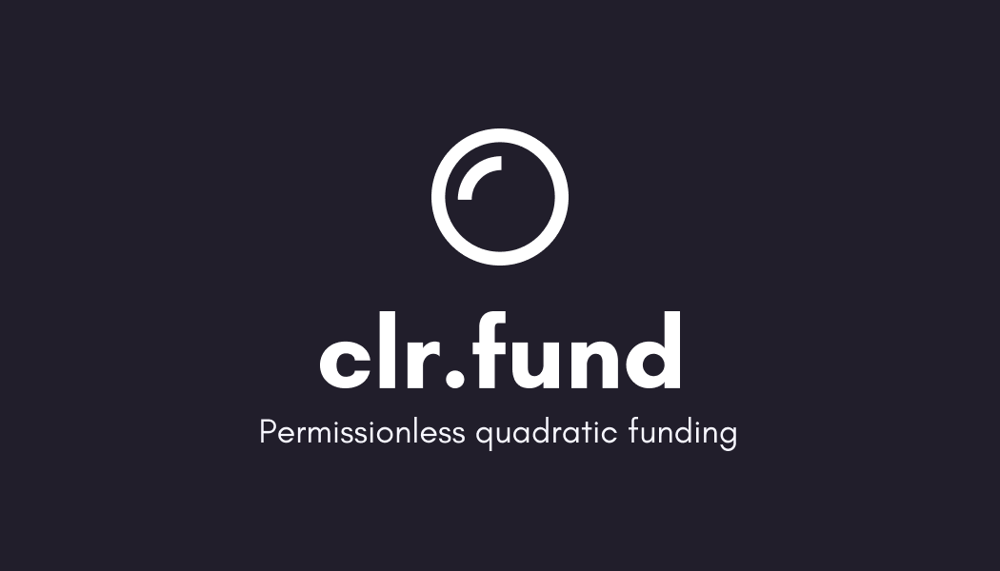

# GRANTS ROUND 11 捐款推荐项目

** **
**主要内容**
>#### 捐赠项目
>#### 省钱技巧
** **

            
#### 捐款项目（点击title即可转入对应页面）

1. [Dataverse: Curate NFTs from around the web with one click](https://gitcoin.co/grants/3531/dataverse-curate-nfts-from-around-the-web-with-on)

推荐级别：⭐⭐⭐⭐

    私人NFTs管理 | 已公测

** **
2. [Decentralized Donations](https://gitcoin.co/grants/3483/decentralized-donations)

推荐级别：⭐⭐⭐

    众筹平台 | 基于MATIC

** **
3. [MatrixETF - The Next Generation of ETF](https://gitcoin.co/grants/3278/matrixetf-the-next-generation-of-etf)

推荐级别：⭐⭐⭐★

    ETF投资平台 | 多方投资

** **
4. [GOATNFT ](https://gitcoin.co/grants/3087/goatnft-nft-trade-platform-provides-whole-sale-sp)

推荐级别：⭐⭐★

    NTF分售 | 租赁 | 拍卖

** **
5. [Dark Forest](https://gitcoin.co/grants/2323/dark-forest)

推荐级别：⭐⭐⭐⭐★

    策略游戏 | zkSNARKs | xDAI

** **
6. [Cross-Asset-Swap](https://gitcoin.co/grants/2281/cross-asset-swap)

推荐级别：⭐⭐★

    类似1inch | 优化交易

** **
7. [DoinGud: NFT ecosystem empowering meaningful creations](https://gitcoin.co/grants/2213/doingud-nft-ecosystem-empowering-meaningful-creat)

推荐级别：⭐⭐⭐

    NFT相关 | 激发创作 | 非盈利

** **

8. [Llama: Treasury Management for DAOs](https://gitcoin.co/grants/1707/llama-treasury-management-for-daos)

推荐级别：⭐⭐⭐⭐

    DAO、DEFI相关 | 财务管理 | 交易报告

** **

9. [Nifty.ink](https://gitcoin.co/grants/1162/niftyink)

推荐级别：⭐⭐⭐★

    NFT相关 | 简易交易 | 基于XDai

** **

10. [rekt.news - The dark web of DeFi journalism](https://gitcoin.co/grants/1632/rektnews-the-dark-web-of-defi-journalism)

推荐级别：⭐⭐⭐

    密码学 | 新闻 | DEFI相关

** **

11. [Frame: Privacy Focused Native Ethereum Wallet](https://gitcoin.co/grants/1143/frame-privacy-focused-native-ethereum-wallet)

推荐级别：⭐⭐★

    钱包 | 隐私 | 多平台

** **

12. [clr.fund](https://gitcoin.co/grants/524/clrfund)

推荐级别：⭐⭐★

    融资众筹 | 反多种debuff 

** **

13. [POAP (Proof of Attendance Protocol)](https://gitcoin.co/grants/490/poap-proof-of-attendance-protocol)

推荐级别：⭐⭐⭐★

    POAP就是力量 | NFT相关 | 出席证明

** **

14. [Rotki - The portfolio tracker and accounting tool that protects your privacy)](https://gitcoin.co/grants/149/rotki-the-portfolio-tracker-and-accounting-tool-t)

推荐级别：⭐⭐⭐

    DEFI相关 | 投资组合 | 会计报告

** **

#### 省钱技巧（交易所开始）

不差钱：直接提到eth主网捐

省钱：交易所把资产换成TRX（因为一般交易所提trx手续都很低）走到 **FTX交易所** 然后更换成ETH，再从FTX所提到主网仅需**0.001eth**手续费 再找个gas低的时间段提到二层，这样路费最少。

极致省钱：省钱的前提下再多找几个人一起开团分担手续费，一套下来大概手续费花了20多u（走DAI贵点）

** **
#请我喝杯咖啡

>**ETH \ BSC**: 
            0x51E4F19959E690178eCa87a5392D11D6BfF20628
            
>**TRON**:
            TRsUeKh25G2viyqy43NBPYe9EehWtp83Ct
